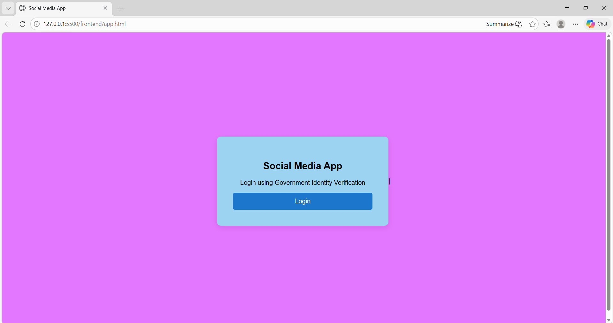
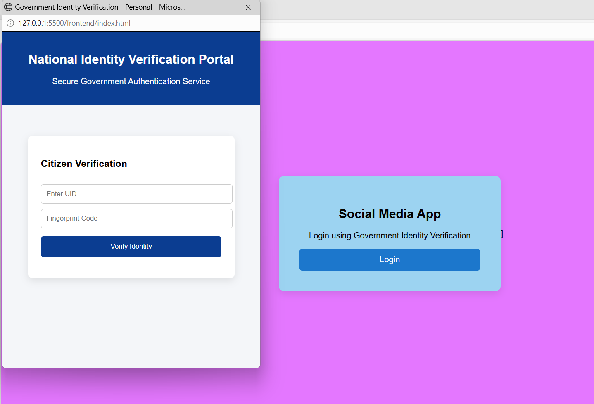
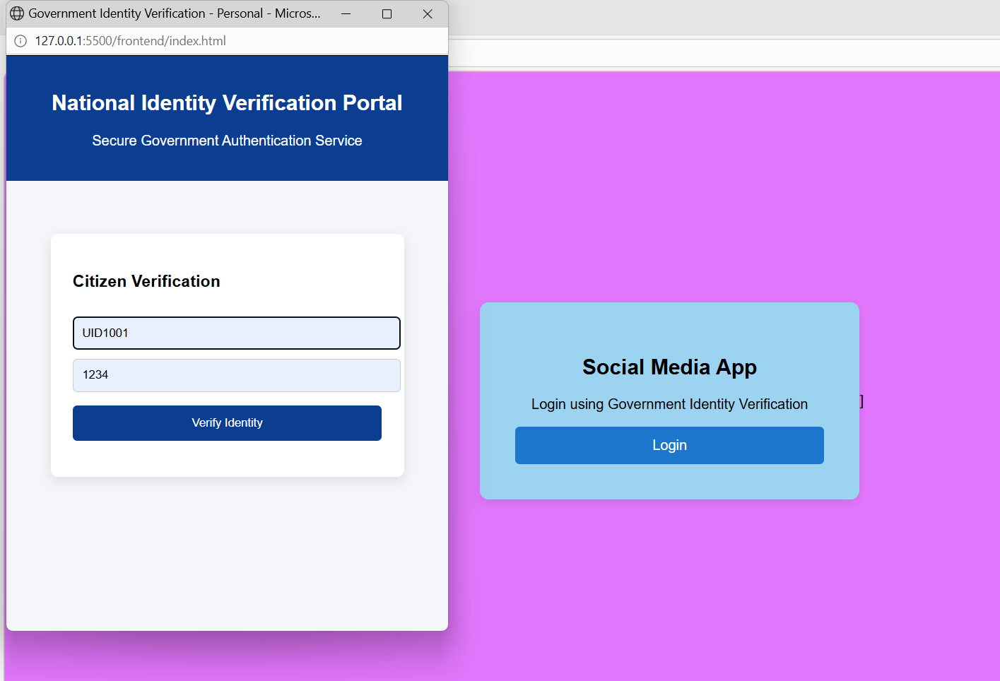
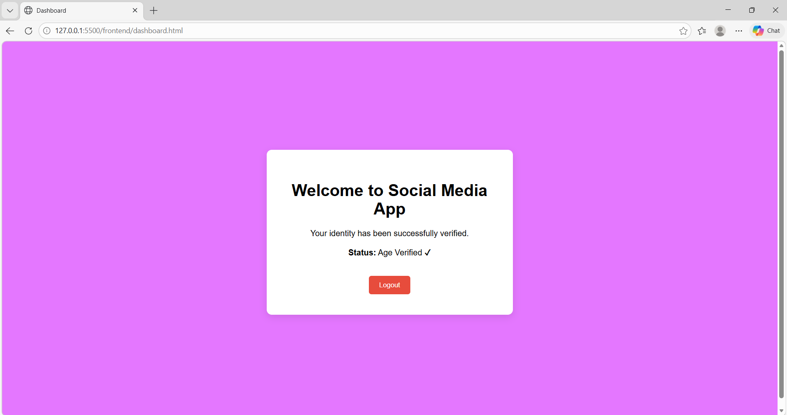
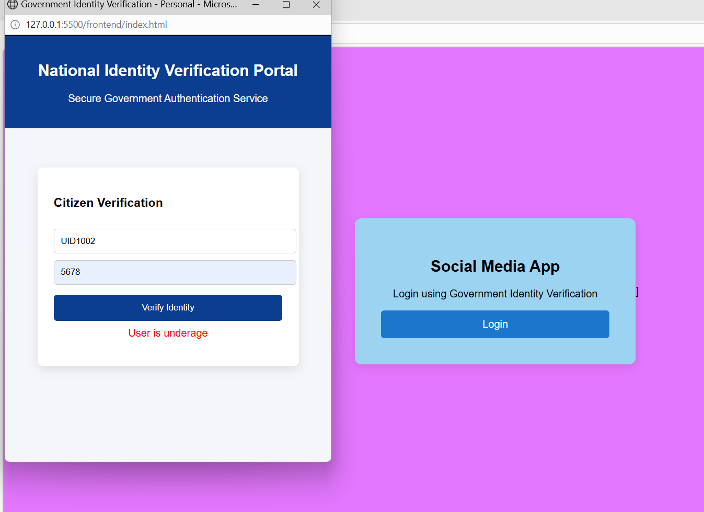

# Identity-Based Age Verification System

A prototype web application demonstrating how online platforms can verify a user's age through a trusted
identity verification workflow instead of relying on self-reported information.

This system simulates a centralized verification process where user identity details are checked against
stored records to determine eligibility for accessing age-restricted digital platforms.

---

## Project Overview

Many online services rely on users to manually enter their date of birth during registration. This approach 
can be unreliable because users may provide incorrect information.

This project presents a prototype workflow where a platform requests age verification from a trusted identity verification service.
The service validates the user's identity details, calculates their age based on stored records, and returns a simple verification result indicating whether the user meets the required age criteria.

---

## System Workflow

1. A user attempts to access an age-restricted online platform.
2. The platform requests age verification.
3. The user is redirected to a simulated identity verification portal.
4. The user enters identity details (UID / fingerprint simulation).
5. The system retrieves the user’s record from a database.
6. The backend calculates the user's age using the stored date of birth.
7. The verification service returns the result (Eligible / Not Eligible).
8. The platform grants or restricts access based on the result.

---

## Features

- Identity-based verification workflow
- Simulated government-style verification portal
- Backend age calculation using stored identity records
- Database lookup for user details
- Access control based on eligibility result
- Simple dashboard for verified users

---

## Technologies Used

### Backend
- Python
- Flask

### Frontend
- HTML
- CSS
- JavaScript

### Database
- SQLite

---

## Project Structure
identity-age-verification-system
│
├── backend
│   ├── app.py
│   └── create_db.py
│
├── frontend
│   ├── index.html
│   ├── app.html
│   └── dashboard.html
│
├── screenshots
│   └── login.png
│
└── users.db

--

## Screenshots

